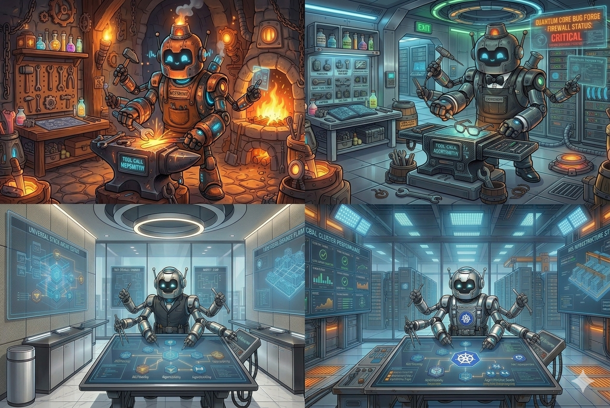

# Smithy



Hub site for the Smithy family of tools.

- **[Smithy CLI](https://github.com/iorubs/smithy-cli)**: orchestrate stacks of MCP servers and agents locally.
- **[MCPSmithy](https://github.com/iorubs/mcpsmithy)**: author and run MCP servers from YAML.
- **[AgentSmithy](https://github.com/iorubs/agentsmithy)**: author and run AI agents from YAML.
- **[Smithy Operator](https://github.com/iorubs/smithy-operator)** _(under construction)_: Kubernetes operator for declarative agentic workloads.

## Local development

Build the image:

```sh
docker build -t smithy-docs .
```

Serve locally on <http://localhost:3000>:

```sh
docker run --rm -p 3000:3000 -v "$(pwd)":/docs smithy-docs
```

Build the static site (output in `./build`):

```sh
docker run --rm -v "$(pwd)":/docs smithy-docs npm run build
```

This is a Docusaurus site. The hub is intentionally minimal; its only job is to introduce the family and link out to each tool's own docs site.
